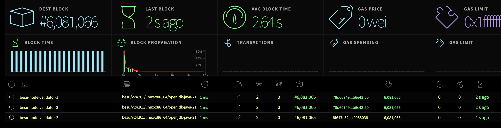
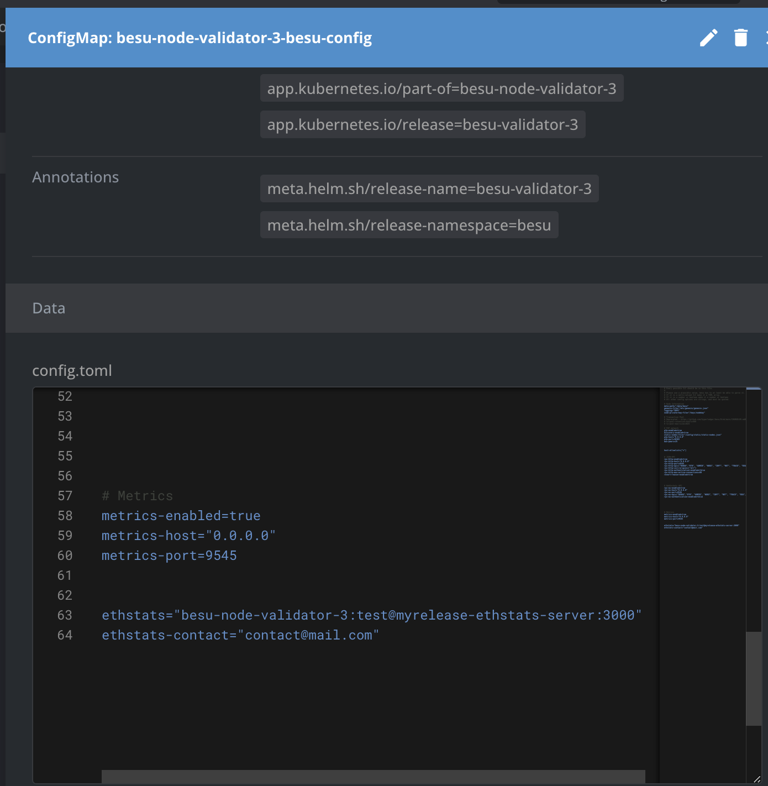

Ethereum Network Stats
===============================================


This is a visual interface for tracking proof-of-work ("mainnet") and proof-of-authority ("testnet") network status. It uses WebSockets to receive stats from running nodes and output them through an angular interface. It is the front-end implementation for [ethstats-client](https://github.com/goerli/ethstats-client).





# Besu Node Validator Deployment with Ethstats Configuration using cluster of kubernetes

This document describes the steps to deploy a Besu node and configure it to send data to an Ethstats server.

## Prerequisites
1. Kubernetes configured and access to the cluster.
2. Helm installed to deploy charts.
3. Ethstats server configuration.

## Installation Steps

### 1. Deploy the Chart
First of all you have to set the correct values in `values.yaml` and also have the image build with the dockerfile inside this repo and upload for example to ecr of aws and put in the the field "repository" in values.yaml, inside the directory chart.
Run the following command to deploy the Besu chart with the initial configurations:

```bash
helm install myrelease ./chart --namespace whereAreNodesDeployed
```

### 2. Configure Ethstats in the ConfigMap
Each validator node has an assigned ConfigMap containing its configuration. We need to add the following two lines to each ConfigMap for all nodes to enable the connection between the validators and the Ethstats server,.

```yaml
# Ethstats Configuration
ethstats="besu-node-validator-1:test@myrelease-ethstats-server:3000"
ethstats-contact="contact@mail.com"  # This field is optional and can be omitted.
```




#### Configuration Details
- `besu-node-validator-1`: Name of the validator node configured in the `configmap`.
- `test`: Websocket password specified in the chart’s `values.yaml`.
- `myrelease-ethstats-server`: Name of the Ethstats dashboard service configured on the chart, that is something like that `values.name-svc`
- `3000`: Ethstats service port configured on the chart.

### 3. Restart Validator Pods
To apply the configuration changes, each validator pod must be restarted. You can do this by deleting the validator pod so Kubernetes will restart it with the new configuration:

```bash
kubectl delete pod <validator-pod-name>
```

### Configuration Explanation
These configuration lines allow each Besu node to send network data to the Ethstats frontend. Enabling this functionality allows the Ethstats server to display each node’s data on its dashboard.

# Besu Node Validator Deployment with Ethstats Configuration on local 


#### Prerequisite
* node
* npm

#### Installation
Make sure you have node.js and npm installed.

Clone the repository and install the dependencies:

```bash
git clone https://github.com/goerli/ethstats-server
cd ethstats-server
npm install
sudo npm install -g grunt-cli
```

#### Build
In order to build the static files you have to run grunt tasks which will generate dist directories containing the js and css files, fonts and images.

```bash
grunt poa
```

To build the static files for a network other than Ethereum copy and change src/js/defaultConfig.js and run the following command.

```bash
grunt poa --configPath="src/js/someOtherConfig.js"
```

#### Run
Start a node process and pass the websocket secret to it.

```bash
WS_SECRET="asdf" npm start
```
Find the interface at http://localhost:3000

## Credits

This project is based on [ethstats-server](https://github.com/goerli/ethstats-server), developed and maintained by the Goerli community. We extend our thanks to the original authors for their work and contributions, which have enabled the building and expansion of this project. This repository includes specific modifications and adaptations made from the original project, under the GPL v3 license.
